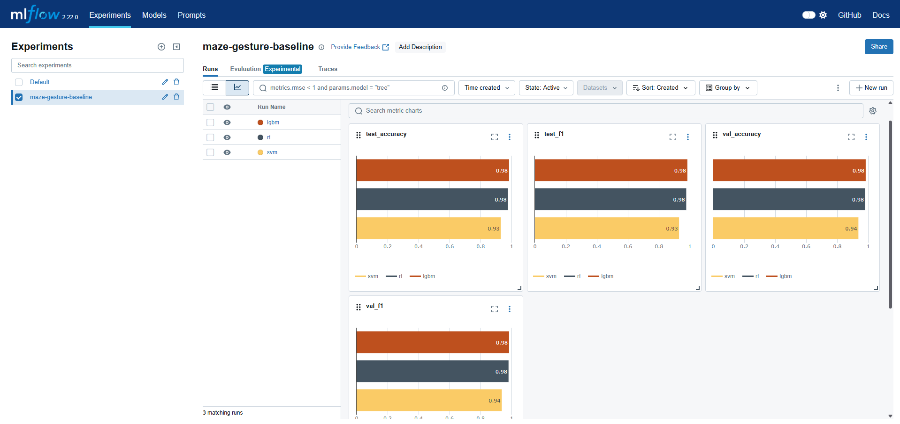
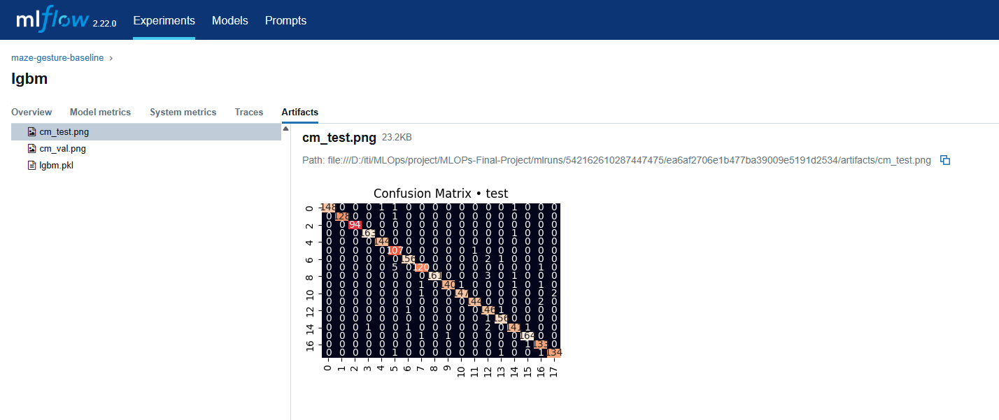
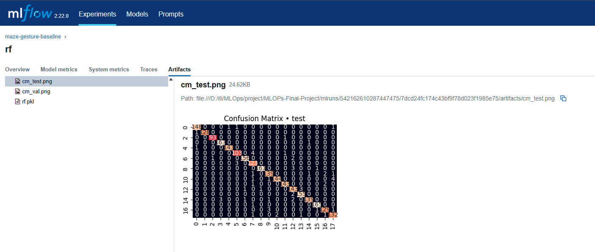
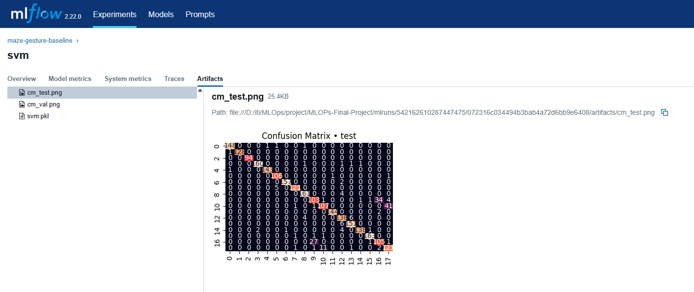
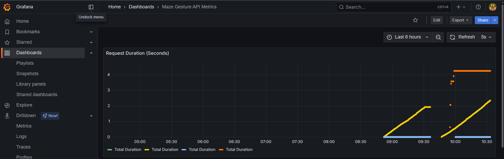
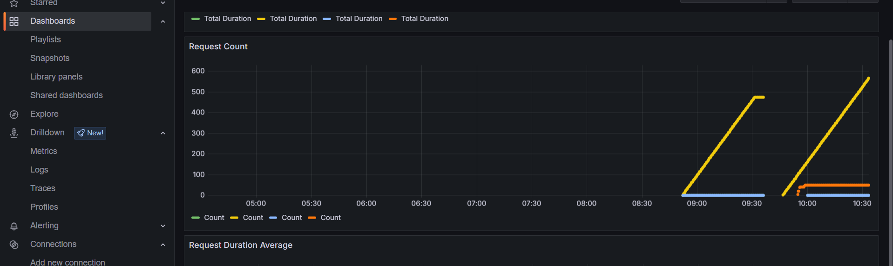
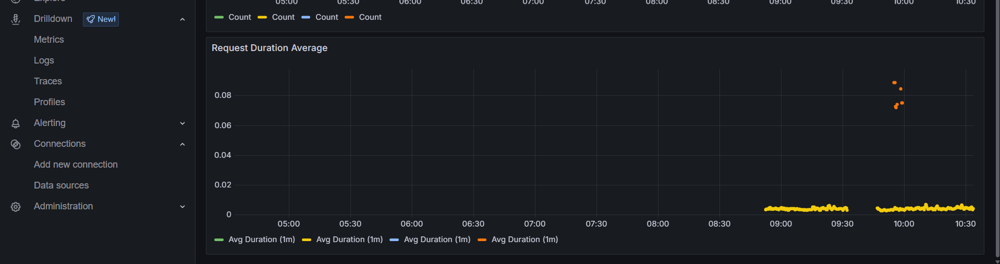

# 🎮 Astray - Gesture-controlled 3D Maze Game with ML Monitoring

Astray is an interactive 3D maze game where you control a ball using either keyboard controls or hand gestures. The game features progressively challenging mazes, smooth 3D graphics powered by Three.js, and includes ML model monitoring capabilities.

## ✨ Features

- 🎯 3D maze navigation with realistic ball physics
- 👋 Hand gesture control using MediaPipe
- ⌨️ Keyboard controls as an alternative input method
- 📈 Progressive difficulty with increasing maze sizes
- 👁️ Real-time hand tracking visualization
- 🎨 Modern 3D graphics with textured walls and ground
- 📊 ML model monitoring with Prometheus and Grafana
- 🐳 Docker containerization for easy deployment

## 🔧 Prerequisites

- 🌐 A modern web browser (Chrome, Firefox, Safari, or Edge)
- 📹 Webcam for gesture control (optional)
- 🐳 Docker and Docker Compose (for ML monitoring setup)
- 🐍 Python 3.8+ (for ML components)
- 💻 Basic understanding of web development (for setup)

## 🚀 Installation

1. Clone the repository:
```bash
git clone https://github.com/yourusername/astray.git
cd astray
```

2. Install Python dependencies:
```bash
pip install -r requirements.txt
```

3. Start the ML monitoring stack using Docker:
```bash
docker-compose up -d
```

4. Ensure you have the following files in your project directory:
   - 📄 `index.html`
   - 🎾 `ball.png` (ball texture)
   - 🧱 `brick.png` (wall texture)
   - 🏗️ `concrete.png` (ground texture)

5. Open `index.html` in your web browser or set up a local server:
```bash
# Using Python
python -m http.server 8000

# Using Node.js
npx serve
```

## 🎮 How to Play

### 🎹 Controls

#### Keyboard Controls:
- ⬆️⬇️⬅️➡️ Arrow Keys or H/J/K/L: Move the ball
- 🔄 G: Toggle gesture control
- ℹ️ I: Show/hide instructions

#### Gesture Controls:
- ☝️ One finger: Move Up
- ✊ Fist: Move Down
- ✌️ Two fingers: Move Left
- 🤟 Three fingers: Move Right

### 🎯 Gameplay

1. 🎯 The goal is to navigate the ball through the maze to reach the exit
2. 📈 Each level increases in difficulty with a larger maze
3. 🛑 The ball will stop when hitting walls
4. 📹 The camera follows the ball's movement
5. ⏱️ Gesture control requires holding the gesture for a brief moment

## 💻 Technical Details

### 🛠️ Technologies Used

- 🎨 Three.js (r128) for 3D rendering
- 🤖 MediaPipe Hands for gesture recognition
- 🎯 HTML5 Canvas for hand tracking visualization
- ⚡ Vanilla JavaScript for game logic
- 📊 Prometheus for metrics collection
- 📈 Grafana for metrics visualization
- 🐳 Docker for containerization
- 🔬 MLflow for experiment tracking

### 📁 Project Structure

```
astray/
├── 📂 app/                # Application code
├── 🧪 tests/             # Test files
├── 📊 grafana/           # Grafana dashboards
├── 📈 mlruns/            # MLflow experiment tracking
├── 📄 index.html         # Main game file
├── 🎾 ball.png           # Ball texture
├── 🧱 brick.png          # Wall texture
├── 🏗️ concrete.png       # Ground texture
├── 🐳 dockerfile         # Docker configuration
├── 🐳 docker-compose.yml # Docker services configuration
├── 📊 prometheus.yml     # Prometheus configuration
├── 📋 requirements.txt   # Python dependencies
└── 📖 README.md          # This file
```

## 🤖 ML Monitoring Setup

The project includes a complete ML monitoring stack for model selection and performance tracking:

1. **Model Selection Pipeline** 🔄
   - 🤖 Automated comparison between RandomForest, SVM, and LightGBM models
   - 📊 Model performance metrics tracked in MLflow
   - ⚡ Automatic model selection based on accuracy and inference time
   - 🔧 Hyperparameter tuning with MLflow tracking

2. **MLflow** 🔬
   - 📦 Model versioning and registry
   - 📊 Experiment tracking for all three models
   - 📈 Performance metrics comparison
   - 📁 Model artifacts storage
   - 🌐 Access at: http://localhost:5000






3. **Prometheus** 📊
   - 📈 Real-time model performance metrics
   - ⏱️ Inference latency tracking
   - 💻 Resource utilization monitoring
   - 🚨 Custom metrics for model drift detection
   - 🌐 Access at: http://localhost:9090

4. **Grafana** 📈
   - 📊 Real-time model performance dashboards
   - 📉 Model comparison visualizations
   - 💻 Resource utilization graphs
   - 🚨 Custom alerts for model drift
   - 🌐 Access at: http://localhost:3000
   - 🔑 Default credentials: admin/admin






### 🐳 Docker Services

The project uses Docker containers for all ML components:

```yaml
services:
  - 📊 prometheus: Latest version for metrics collection
  - 📈 grafana: Latest version for visualization
  - 🔬 mlflow: Latest version for experiment tracking
  - 🤖 model-service: Custom service for model inference
```

### 🔄 Model Selection Process

1. **Data Collection** 📥
   - 🎮 Game state data collection
   - 👤 Player interaction metrics
   - 📊 Performance metrics

2. **Model Training** 🎓
   - 🌲 RandomForest: For robust classification
   - 📐 SVM: For high-dimensional data
   - ⚡ LightGBM: For fast inference and high accuracy

3. **Performance Monitoring** 📊
   - 🎯 Real-time accuracy tracking
   - ⏱️ Inference latency monitoring
   - 💻 Resource utilization tracking
   - 🚨 Model drift detection

4. **Model Deployment** 🚀
   - 🤖 Automatic model selection based on metrics
   - 🐳 Containerized deployment
   - A/B testing capability
   - 🔄 Rollback support

## 👥 Contributing

1. 🍴 Fork the repository
2. 🌿 Create your feature branch (`git checkout -b feature/AmazingFeature`)
3. 💾 Commit your changes (`git commit -m 'Add some AmazingFeature'`)
4. 📤 Push to the branch (`git push origin feature/AmazingFeature`)
5. 🔄 Open a Pull Request

## 📄 License

This project is licensed under the MIT License - see the LICENSE file for details.

## 🙏 Acknowledgments

- 🎨 Three.js community for the 3D rendering library
- 🤖 MediaPipe team for the hand tracking solution
- 🎮 Original Astray project for maze generation algorithm
- 📊 Prometheus and Grafana communities for monitoring tools


Enjoy playing Astray! 🎮
